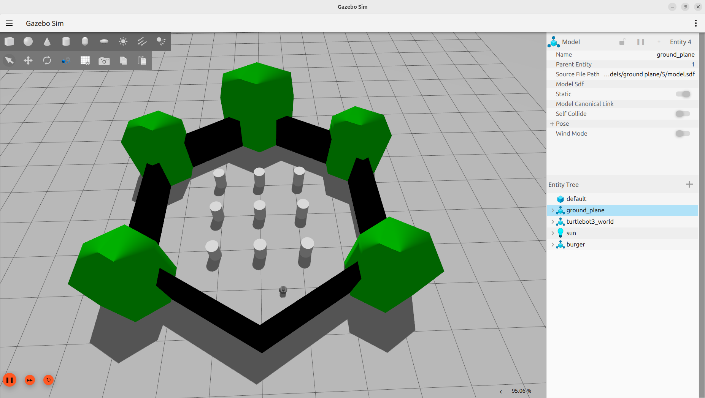
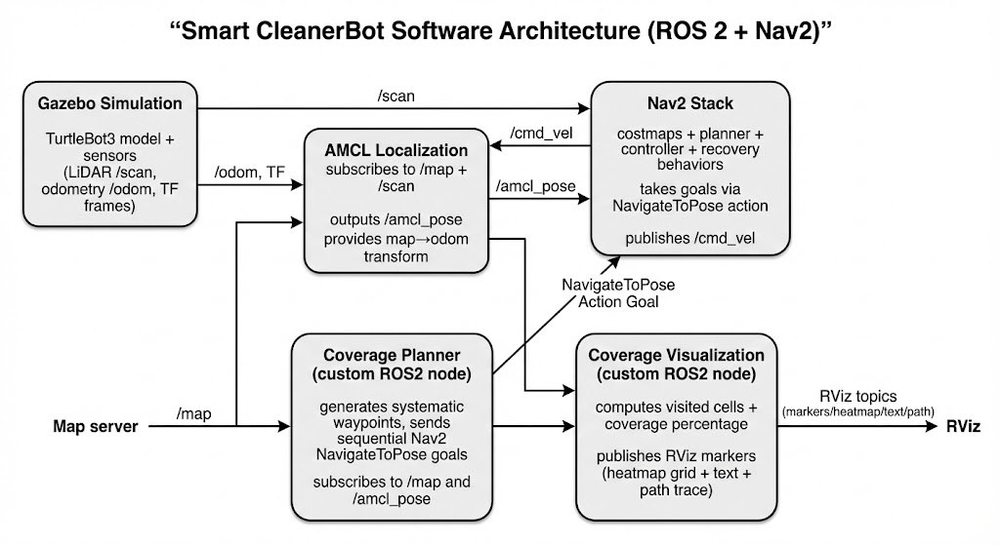
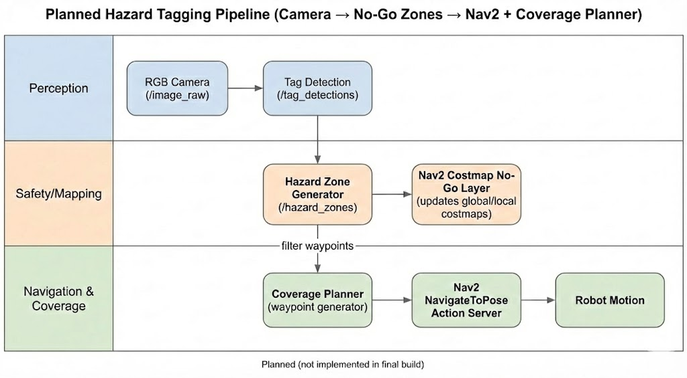
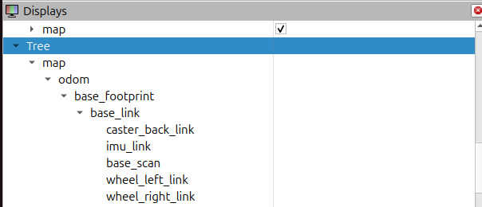

# ro-botiq 🤖

A **ROS 2** package for autonomous robot coverage path planning. The robot automatically plans and executes a **lawnmower (boustrophedon) pattern** over a defined area, using Nav2 for navigation and AMCL for localization. Real-time coverage visualization is provided via RViz markers.

---

## 🖼️ Screenshots

### Gazebo Simulation — TurtleBot3 World


### Software Architecture


### Planned Hazard Tagging Pipeline


### RViz — Live Coverage Tracking


### RViz — Path Coverage


### TF Tree


---

## 📦 Package: `cleaner_coverage`

| Node | Entry Point | Description |
|---|---|---|
| `coverage_node.py` | `coverage` | Plans and executes the lawnmower path via Nav2 |
| `coverage_viz.py` | `coverage_viz` | Tracks and visualizes coverage percentage in RViz |

---

## 🧠 Algorithm

### Coverage Planner — Lawnmower (Boustrophedon) Pattern

The planner generates a **boustrophedon (back-and-forth) sweep** over a rectangular area:

1. **Waits** for a valid map (`/map`) and an AMCL pose (`/amcl_pose`)
2. **Auto-centers** the coverage area on the robot's current position
3. **Generates waypoints** in alternating left→right and right→left rows, separated by a configurable `spacing`
4. **Sends each waypoint** sequentially to Nav2's `navigate_to_pose` action server
5. **Skips failed waypoints** (ABORTED/CANCELED) and continues with the next one

```
Row 0:  → → → → → → → →
Row 1:  ← ← ← ← ← ← ← ←
Row 2:  → → → → → → → →
...
```

### Coverage Visualizer

Tracks which cells of the occupancy grid the robot has physically visited (within a configurable radius), and publishes:
- **MarkerArray** — green cube overlay on visited cells in RViz
- **Coverage %** — live text marker showing `visited / total free cells`
- **Path** — the robot's full trajectory as a `nav_msgs/Path`

Supports both **odometry + TF** and **AMCL pose** as position sources.

---

## ⚙️ Parameters

### `coverage_node`

| Parameter | Default | Description |
|---|---|---|
| `width` | `2.0` m | Coverage area width (X axis) |
| `height` | `2.0` m | Coverage area height (Y axis) |
| `spacing` | `0.45` m | Distance between sweep rows |
| `map_topic` | `/map` | OccupancyGrid topic |
| `pose_topic` | `/amcl_pose` | Localization pose topic |
| `frame_id` | `map` | Goal frame ID |

### `coverage_viz`

| Parameter | Default | Description |
|---|---|---|
| `radius_m` | `0.40` m | Robot footprint radius for coverage tracking |
| `publish_hz` | `2.0` Hz | Visualization publish rate |
| `pose_source` | `odom` | Pose source: `odom` or `amcl` |
| `odom_topic` | `/odom` | Odometry topic |
| `amcl_topic` | `/amcl_pose` | AMCL pose topic |

---

## 🚀 Getting Started

### Prerequisites

- [ROS 2 Humble](https://docs.ros.org/en/humble/Installation.html) (or newer)
- [Nav2](https://navigation.ros.org/) stack installed
- AMCL localization active with a valid map

### Build

```bash
cd ~/ros2_ws/src
# clone or copy this package here
cd ~/ros2_ws
colcon build --packages-select cleaner_coverage
source install/setup.bash
```

### Run

**Start the coverage planner:**
```bash
ros2 run cleaner_coverage coverage
```

**Start the visualization node:**
```bash
ros2 run cleaner_coverage coverage_viz
```

**Override parameters at runtime:**
```bash
ros2 run cleaner_coverage coverage \
  --ros-args -p width:=3.0 -p height:=3.0 -p spacing:=0.4
```

### RViz Topics to Add

| Topic | Type | What it shows |
|---|---|---|
| `/coverage_markers` | `MarkerArray` | Green visited cells |
| `/coverage_text` | `Marker` | Coverage % text |
| `/coverage_path` | `Path` | Robot trajectory |

---

## 📁 Project Structure

```
src/
├── cleaner_coverage/
│   ├── coverage_node.py   # Lawnmower planner + Nav2 client
│   └── coverage_viz.py    # Coverage tracking + RViz visualization
├── package.xml
├── setup.cfg
└── setup.py
```

---

## 📄 License

This project is licensed under the **MIT License** — see [LICENSE](LICENSE) for details.
